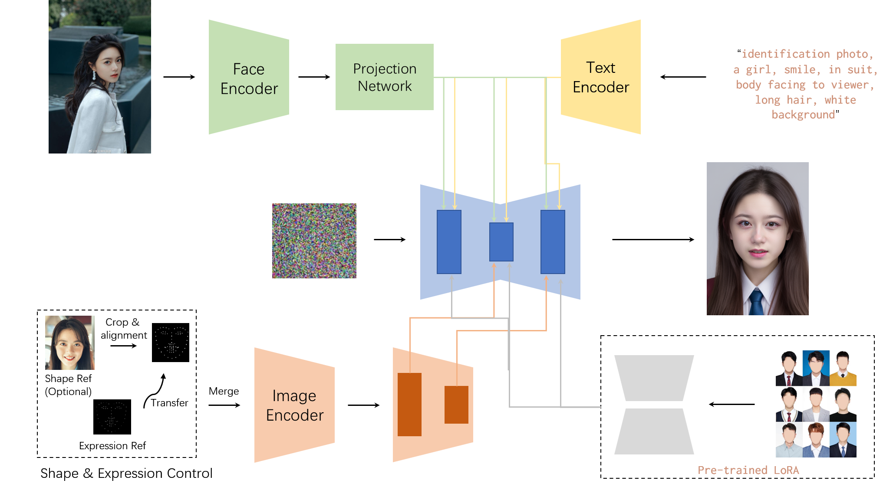
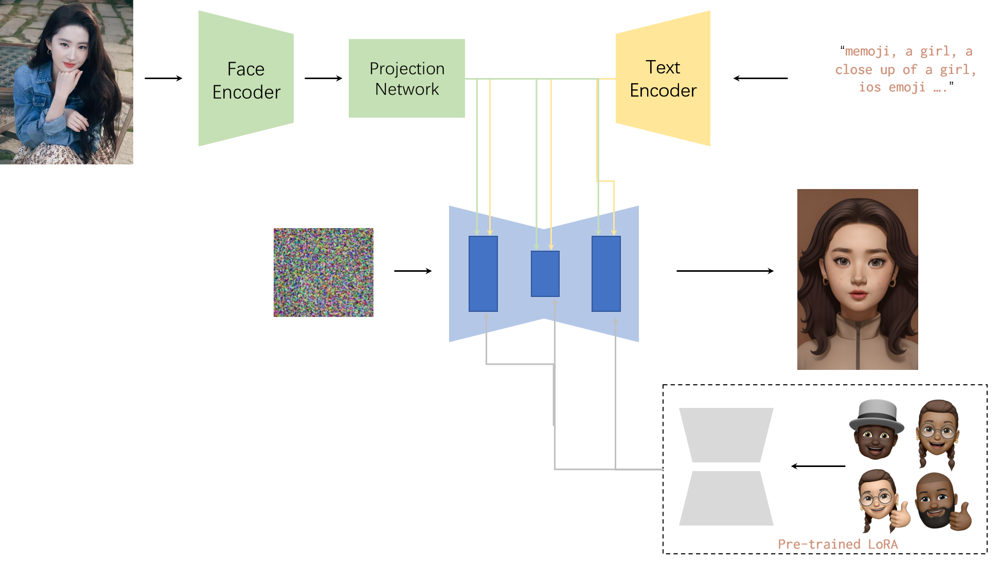

# InstantPhotoStudio
Using a series of open-source algorithms, we have built an AI-powered photo studio. With just a single photo, it can generate the desired images, and the entire process is completed within seconds.

# Code

image: A photo of the person who needs to be used for the ID card should be clear and with a frontal face.

pose_image: A photo of the person who needs to be taken for ID card should have a clear facial outline.

std_image: Template photo from which the expression will be transferred to the target image

# Function

:heavy_check_mark: ID photo

:heavy_check_mark: Memoji photo

# Methods / Pipeline

ID photo:

Memoji photo:

